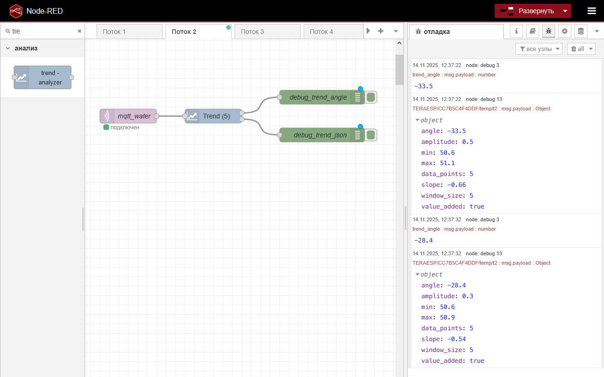

# node-red-contrib-trend-analyzer

A Node-RED node for real-time trend analysis with sliding window and slope calculation.

## Features

- Real-time trend analysis with configurable window size
- Slope and angle calculation for trend detection  
- Multiple outputs including JSON with full data
- Configurable minimum interval for data collection
- Adaptive trend channels for anomaly detection

## Installation, Ubuntu Server

```bash 

cd ~/.node-red

npm install github:denis-pv/node-red-contrib-trend-analyzer

# Then restart Node-RED
```
## Installation, Windows 

```bash 

cd %USERPROFILE%/.node-red

npm install github:denis-pv/node-red-contrib-trend-analyzer

# Then restart Node-RED
```


## Screenshots


*Example 1*


*Example 2*

## Usage

1. Add node to flow
2. Configure settings:
   - **Window Size**: 5-100 points
   - **Multiplier**: 0.01-5.0
   - **Interval**: 0-60 sec